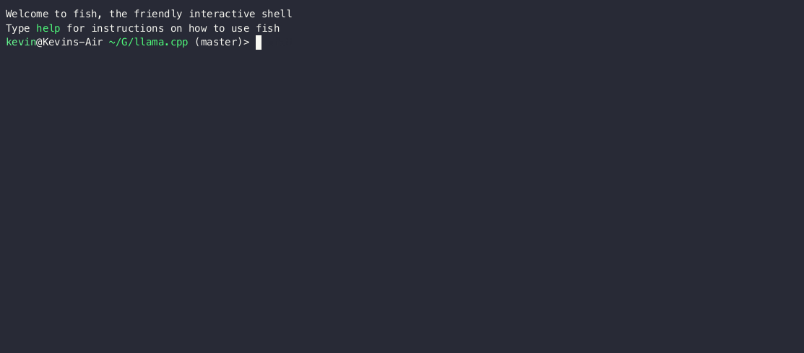

# Alpaca.cpp

[](https://github.com/ggerganov/llama.cpp/actions)
[](https://opensource.org/licenses/MIT)

Inference of [LLaMA](https://arxiv.org/abs/2302.13971) model in pure C/C++

**Hot topics:**

- RMSNorm implementation / fixes: https://github.com/ggerganov/llama.cpp/issues/173
- Cache input prompts for faster initialization: https://github.com/ggerganov/llama.cpp/issues/64
- Create a `llama.cpp` logo: https://github.com/ggerganov/llama.cpp/issues/105

## Description

The main goal is to run the model using 4-bit quantization on a MacBook

- Plain C/C++ implementation without dependencies
- Apple silicon first-class citizen - optimized via ARM NEON
- AVX2 support for x86 architectures
- Mixed F16 / F32 precision
- 4-bit quantization support
- Runs on the CPU

This was [hacked in an evening](https://github.com/ggerganov/llama.cpp/issues/33#issuecomment-1465108022) - I have no idea if it works correctly.
Please do not make conclusions about the models based on the results from this implementation.
For all I know, it can be completely wrong. This project is for educational purposes.
New features will probably be added mostly through community contributions.

Supported platforms:

- [X] Mac OS
- [X] Linux
- [X] Windows (via CMake)
- [X] Docker

---

Here is a typical run using LLaMA-7B:

```java
make -j && ./main -m ./models/7B/ggml-model-q4_0.bin -p "Building a website can be done in 10 simple steps:" -n 512
I llama.cpp build info:
I UNAME_S:  Darwin
I UNAME_P:  arm
I UNAME_M:  arm64
I CFLAGS:   -I.              -O3 -DNDEBUG -std=c11   -fPIC -pthread -DGGML_USE_ACCELERATE
I CXXFLAGS: -I. -I./examples -O3 -DNDEBUG -std=c++11 -fPIC -pthread
I LDFLAGS:   -framework Accelerate
I CC:       Apple clang version 14.0.0 (clang-1400.0.29.202)
I CXX:      Apple clang version 14.0.0 (clang-1400.0.29.202)

make: Nothing to be done for `default'.
main: seed = 1678486056
llama_model_load: loading model from './models/7B/ggml-model-q4_0.bin' - please wait ...
llama_model_load: n_vocab = 32000
llama_model_load: n_ctx   = 512
llama_model_load: n_embd  = 4096
llama_model_load: n_mult  = 256
llama_model_load: n_head  = 32
llama_model_load: n_layer = 32
llama_model_load: n_rot   = 128
llama_model_load: f16     = 2
llama_model_load: n_ff    = 11008
llama_model_load: ggml ctx size = 4529.34 MB
llama_model_load: memory_size =   512.00 MB, n_mem = 16384
llama_model_load: .................................... done
llama_model_load: model size =  4017.27 MB / num tensors = 291

main: prompt: 'Building a website can be done in 10 simple steps:'
main: number of tokens in prompt = 15
     1 -> ''
  8893 -> 'Build'
   292 -> 'ing'
   263 -> ' a'
  4700 -> ' website'
   508 -> ' can'
   367 -> ' be'
  2309 -> ' done'
   297 -> ' in'
 29871 -> ' '
 29896 -> '1'
 29900 -> '0'
  2560 -> ' simple'
  6576 -> ' steps'
 29901 -> ':'

sampling parameters: temp = 0.800000, top_k = 40, top_p = 0.950000
Run a fast ChatGPT-like model locally on your device. The screencast below is not sped up and running on an M2 Macbook Air with 4GB of weights. 


[](https://asciinema.org/a/dfJ8QXZ4u978Ona59LPEldtKK)


This combines the [LLaMA foundation model](https://github.com/facebookresearch/llama) with an [open reproduction](https://github.com/tloen/alpaca-lora) of [Stanford Alpaca](https://github.com/tatsu-lab/stanford_alpaca) a fine-tuning of the base model to obey instructions (akin to the [RLHF](https://huggingface.co/blog/rlhf) used to train ChatGPT) and a set of modifications to [llama.cpp](https://github.com/ggerganov/llama.cpp) to add a chat interface. 

https://user-images.githubusercontent.com/1991296/224442907-7693d4be-acaa-4e01-8b4f-add84093ffff.mp4

## Usage

Here are the step for the LLaMA-7B model:

```bash
# build this repo
git clone https://github.com/ggerganov/llama.cpp
cd llama.cpp
make

# obtain the original LLaMA model weights and place them in ./models
ls ./models
65B 30B 13B 7B tokenizer_checklist.chk tokenizer.model

# install Python dependencies
python3 -m pip install torch numpy sentencepiece

# convert the 7B model to ggml FP16 format
python3 convert-pth-to-ggml.py models/7B/ 1

# quantize the model to 4-bits
./quantize.sh 7B

# run the inference
./main -m ./models/7B/ggml-model-q4_0.bin -n 128
```

When running the larger models, make sure you have enough disk space to store all the intermediate files.

TODO: add model disk/mem requirements

### Interactive mode

If you want a more ChatGPT-like experience, you can run in interactive mode by passing `-i` as a parameter.
In this mode, you can always interrupt generation by pressing Ctrl+C and enter one or more lines of text which will be converted into tokens and appended to the current context. You can also specify a *reverse prompt* with the parameter `-r "reverse prompt string"`. This will result in user input being prompted whenever the exact tokens of the reverse prompt string are encountered in the generation. A typical use is to use a prompt which makes LLaMa emulate a chat between multiple users, say Alice and Bob, and pass `-r "Alice:"`.

Here is an example few-shot interaction, invoked with the command
```
./main -m ./models/13B/ggml-model-q4_0.bin -n 256 --repeat_penalty 1.0 --color -i -r "User:" \
                                           -p \
"Transcript of a dialog, where the User interacts with an Assistant named Bob. Bob is helpful, kind, honest, good at writing, and never fails to answer the User's requests immediately and with precision.

User: Hello, Bob.
Bob: Hello. How may I help you today?
User: Please tell me the largest city in Europe.
Bob: Sure. The largest city in Europe is Moscow, the capital of Russia.
User:"
## Get started

```sh
git clone https://github.com/antimatter15/alpaca.cpp
cd alpaca.cpp

make chat
./chat
```

You can download the weights for `ggml-alpaca-7b-q4.bin` with BitTorrent `magnet:?xt=urn:btih:5aaceaec63b03e51a98f04fd5c42320b2a033010&dn=ggml-alpaca-7b-q4.bin&tr=udp%3A%2F%2Ftracker.opentrackr.org%3A1337%2Fannounce&tr=udp%3A%2F%2Fopentracker.i2p.rocks%3A6969%2Fannounce`


Alternatively you can download them with IPFS.

```
# any of these will work
wget -O ggml-alpaca-7b-q4.bin -c https://gateway.estuary.tech/gw/ipfs/QmQ1bf2BTnYxq73MFJWu1B7bQ2UD6qG7D7YDCxhTndVkPC
wget -O ggml-alpaca-7b-q4.bin -c https://ipfs.io/ipfs/QmQ1bf2BTnYxq73MFJWu1B7bQ2UD6qG7D7YDCxhTndVkPC
wget -O ggml-alpaca-7b-q4.bin -c https://cloudflare-ipfs.com/ipfs/QmQ1bf2BTnYxq73MFJWu1B7bQ2UD6qG7D7YDCxhTndVkPC
```

Save the `ggml-alpaca-7b-q4.bin` file in the same directory as your `./chat` executable. 

The weights are based on the published fine-tunes from `alpaca-lora`, converted back into a pytorch checkpoint with a [modified script](https://github.com/tloen/alpaca-lora/pull/19) and then quantized with llama.cpp the regular way. 

## Windows Setup

- Download and install CMake: <https://cmake.org/download/>
- Download and install `git`. If you've never used git before, consider a GUI client like <https://desktop.github.com/>
- Clone this repo using your git client of choice (for GitHub Desktop, go to File -> Clone repository -> From URL and paste `https://github.com/antimatter15/alpaca.cpp` in as the URL)
- Open a Windows Terminal inside the folder you cloned the repository to
- Run the following commands one by one:

```ps1
cmake .
cmake --build . --config Release
```

- Download the weights via any of the links in "Get started" above, and save the file as `ggml-alpaca-7b-q4.bin` in the main Alpaca directory.
- In the terminal window, run this command:
```ps1
.\Release\chat.exe
```
- (You can add other launch options like `--n 8` as preferred onto the same line)
- You can now type to the AI in the terminal and it will reply. Enjoy!

## 13B

TODO

Torrent: `magnet:?xt=urn:btih:053b3d54d2e77ff020ebddf51dad681f2a651071&dn=ggml-alpaca-13b-q4.bin&tr=udp%3A%2F%2Ftracker.opentrackr.org%3A1337%2Fannounce&tr=udp%3A%2F%2Fopentracker.i2p.rocks%3A6969%2Fannounce&tr=udp%3A%2F%2Ftracker.openbittorrent.com%3A6969%2Fannounce&tr=udp%3A%2F%2F9.rarbg.com%3A2810%2Fannounce`


```
./chat -m ggml-alpaca-13b-q4.bin
```

## Credit

This combines [Facebook's LLaMA](https://github.com/facebookresearch/llama), [Stanford Alpaca](https://crfm.stanford.edu/2023/03/13/alpaca.html), [alpaca-lora](https://github.com/tloen/alpaca-lora) and [corresponding weights](https://huggingface.co/tloen/alpaca-lora-7b/tree/main) by Eric Wang (which uses [Jason Phang's implementation of LLaMA](https://github.com/huggingface/transformers/pull/21955) on top of Hugging Face Transformers), and [llama.cpp](https://github.com/ggerganov/llama.cpp) by Georgi Gerganov. The chat implementation is based on Matvey Soloviev's [Interactive Mode](https://github.com/ggerganov/llama.cpp/pull/61) for llama.cpp. Inspired by [Simon Willison's](https://til.simonwillison.net/llms/llama-7b-m2) getting started guide for LLaMA.

### Docker

#### Prerequisites
* Docker must be installed and running on your system.
* Create a folder to store big models & intermediate files (in ex. im using /llama/models)

#### Images
We have two Docker images available for this project:

1. `ghcr.io/ggerganov/llama.cpp:full`: This image includes both the main executable file and the tools to convert LLaMA models into ggml and convert into 4-bit quantization.
2. `ghcr.io/ggerganov/llama.cpp:light`: This image only includes the main executable file.

#### Usage

The easiest way to download the models, convert them to ggml and optimize them is with the --all-in-one command which includes the full docker image.

 ```bash
docker run -v /llama/models:/models ghcr.io/ggerganov/llama.cpp:full --all-in-one "/models/" 7B
```

On complete, you are ready to play!

```bash
docker run -v /llama/models:/models ghcr.io/ggerganov/llama.cpp:full --run -m /models/7B/ggml-model-q4_0.bin -p "Building a website can be done in 10 simple steps:" -n 512
```

or with light image:

```bash
docker run -v /llama/models:/models ghcr.io/ggerganov/llama.cpp:light -m /models/7B/ggml-model-q4_0.bin -p "Building a website can be done in 10 simple steps:" -n 512
```

## Disclaimer

Note that the model weights are only to be used for research purposes, as they are derivative of LLaMA, and uses the published instruction data from the Stanford Alpaca project which is generated by OpenAI, which itself disallows the usage of its outputs to train competing models. 


- Contributors can open PRs
- Collaborators can push to branches in the `llama.cpp` repo and merge PRs into the `master` branch
- Collaborators will be invited based on contributions
- Any help with managing issues and PRs is very appreciated!
- Make sure to read this: [Inference at the edge](https://github.com/ggerganov/llama.cpp/discussions/205)

### Coding guidelines

- Avoid adding third-party dependencies, extra files, extra headers, etc.
- Always consider cross-compatibility with other operating systems and architectures
- Avoid fancy looking modern STL constructs, use basic `for` loops, avoid templates, keep it simple
- There are no strict rules for the code style, but try to follow the patterns in the code (indentation, spaces, etc.). Vertical alignment makes things more readable and easier to batch edit
- Clean-up any trailing whitespaces, use 4 spaces indentation, brackets on same line, `void * ptr`, `int & a`
- See [good first issues](https://github.com/ggerganov/llama.cpp/issues?q=is%3Aissue+is%3Aopen+label%3A%22good+first+issue%22) for tasks suitable for first contributions
